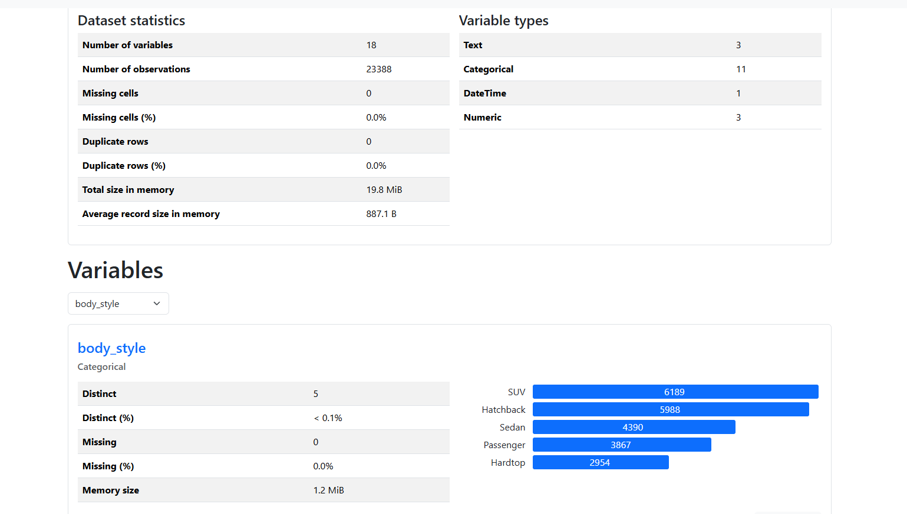

# DDCA 2025 - final project - Car Sales Data Pipeline

## Introduction
This project implements a comprehensive data pipeline for **Car Sales Data** following the Medallion Architecture. The pipeline efficiently handles data ingestion, cleaning, transformation, and visualization. Key concepts such as metadata tracking, data lineage, data contracts, and API integration are incorporated to ensure data reliability. Additionally, a **Time Series Model** predicts future car sales trends. 

Some notes:
- This project was done on the Databricks platform, and thus may require some adjustments to run somewhere else.
- The paths are all relative to our workspace, so you may need to adjust them.
- The original dataset can be found [here](https://www.kaggle.com/datasets/missionjee/car-sales-report).
- We split the dataset into 3 tables and added more data to companies table.
- We injected some errors, anomalies, and duplications to the data to show how we handle them.
- NGROK token is required to run the API. You can get it from [here](https://dashboard.ngrok.com/get-started/your-authtoken).
---

## Project Group Information

**Group Name:** Project Group 1  

**Group Members & Contributions:**  
- **Masa Cirkovic**:
  - Basic & Advanced Metadata
  - Data Lineage
  - Pipeline Statistics
  - Data Sharing
  - Data Contracts
  - API
  - Schema/Data testing
  - Logging
- **Mete Harun Akcay**:
  - Data Ingestion
  - Data Cleaning & Processing
  - Medallion Architecture
  - ML model
  - Performance Tuning
  - Visualizations
  


---

## Table of Contents
- [Medallion](#medallion) section outlines the Medallion Architecture and explains the implementation of **Bronze**, **Silver**, and **Golden** layers for structured data processing.
- [Profiling & Visualizations](#profiling--visualizations) section describes the dataset profiling process using the **pandas profiling** library and presents various **visualizations** for data insights.

- [Metadata Tracking & Data Lineage](#metadata-tracking--data-lineage) section explains how **metadata tracking** is implemented to maintain comprehensive records of data processes, along with **data lineage** to track the data journey.

- [Data Contracts](#data-contracts) section defines and implements **data contracts** to enforce data quality and integrity across all stages of the data pipeline.

- [API](#api) section outlines the development of a basic **FastAPI** implementation that enables users to access and download the data from the Golden Layer via API endpoints.

- [Time Series Modeling](#time-series-modeling) section covers the development of a **Time Series Forecasting Model** using the **ARIMA** framework to predict future car sales trends.

- [Logging](#loggerpy) script is responsible for **structured logging** throughout the data pipeline, ensuring key process steps and errors are efficiently tracked.

- [Tasks](#tasks) section will list all the tasks implemented for this project and show how we did each task with proper examples.

---

## Medallion

This section explains the steps performed in [01 - Medallion](code/01%20-%20Medallion.ipynb).  

The process begins with reading three different data files: two **structured CSV files** and a **semi-structured JSON file**.  

The data sources are as follows:  
### Car Sales Data
**[Car Sales Data](/data/rawdata/car_sales_data.csv)** is a structured CSV file that contains information about 24,184 car sales. The columns in this dataset include:  

- **car** — Unique identifier for each car.  
- **date** — The sale date.  
- **dealer_name** — Name of the car dealer.  
- **dealer_region** — The region where the sale occurred.  
- **company** — The company code for the car's manufacturer.  
- **model** — The model name of the car.  
- **engine** — Details about the car's engine type.  
- **transmission** — The type of transmission (Auto/Manual).  
- **color_car** — The car's color.  
- **body_style** — Vehicle type (e.g., SUV, Passenger).  
- **price** — The sale price of the car in dollars.
  
First three rows are given below:

| car             |_c0|   date       | dealer_name                             | dealer_region | company  | model      | engine                   | transmission | color_car | body_style | price  |
|-----------------|---|--------------|-----------------------------------------|----------------|-----------|-------------|--------------------------|----------------|-------------|--------------|----------|
| C_CND_000001     |0| 1/2/2022   | Buddy Storbeck's Diesel Service Inc     | Middletown     | CMP_001    | Expedition   | Double Overhead Camshaft  | Auto           | Black        | SUV           | $26,000  |
| C_CND_000002     |1| 1/2/2022   | C & M Motors Inc                        | Aurora         | CMP_002    | Durango      | Double Overhead Camshaft  | Auto           | Black        | SUV           | $19,000  |
| C_CND_000003     |2| 1/2/2022   | Capitol KIA                              | Greenville     | CMP_003    | Eldorado     | Overhead Camshaft         | Manual          | Red          | Passenger      | $31,500  |

### Companies Data
**[Companies Data](/data/rawdata/companies_data.json)** is a semi-structured JSON file that contains information about 30 car manufacturers. Each record includes key company details such as:

- **company_id** — Unique identifier for each company.  
- **company_name** — The name of the car manufacturer.  
- **company_type** — Indicates whether the company operates as a private entity or a division.  
- **founding_year** — The year the company was founded.  
- **headquarters** — The country where the company's headquarters is located.  

Below is an example of the JSON structure:

```json
[
    {
        "company_id": "CMP_001",
        "company_name": "Ford",
        "company_type": "private",
        "founding_year": 1903,
        "headquarters": "United States"
    },
    {
        "company_id": "CMP_002",
        "company_name": "Dodge",
        "company_type": "division",
        "founding_year": 1900,
        "headquarters": "US"
    },
    {
        "company_id": "CMP_003",
        "company_name": "Cadillac",
        "company_type": "division",
        "founding_year": 1902,
        "headquarters": "United States"
    }
]
 ``` 
### Customers Data
**[Customers Data](/data/rawdata/customers_data.csv)** is a structured CSV file that contains customer information with 23,907 rows. Each record includes key details about the customer, such as:

- **car_id** — A unique identifier that matches the corresponding car sales record.  
- **name** — The customer's first name.  
- **gender** — The gender of the customer.  
- **annual_income** — The customer's reported annual income in dollars.  

Below is a sample of the dataset:

| **car_id**       | **name**     | **gender** | **annual_income** |
|------------------|--------------|-------------|--------------------|
| C_CND_000001      | Geraldine     | Male         | $13,500            |
| C_CND_000002      | Gia           | Male         | $1,480,000         |
| C_CND_000003      | Gianna        | Male         | $1,035,000         |


### Bronze Layer
The **[Bronze Layer](/docs/medallion/bronze)** stores the raw data ingested directly from the source files with minimal or no transformation. We read above-mentioned three files and saved in the Bronze Layer.

Each dataset was read using Spark's `.read.format()` method to ensure flexibility with structured and semi-structured data. The data was saved in **Delta format**, which enhances performance and reliability in data lake environments.

To manage potential schema mismatches or changes, the `.mode("overwrite")` option was used to ensure that each ingestion refreshes the data completely.

Additionally, a **bronze_statistics_df** DataFrame was maintained to track key statistics about the data ingestion process. This DataFrame includes:

- **File Name** — The name of the ingested file.  
- **Records** — The total number of records ingested.  
- **Size (in bytes)** — The file size for reference.  
- **Format** — The file format (e.g., CSV, JSON).  
- **Ingestion Time (in seconds)** — The time taken for data ingestion.  
- **Timestamp** — The exact date and time when the data was ingested.

The statistics for this layer is given below:

**Bronze Layer Statistics**

| File               | Records | Size (Bytes) | Format | Ingestion Time (s) | Timestamp                      |
|--------------------|---------|---------------|---------|---------------------|------------------------------|
| `car_sales_data`    | 24,183   | 3,183,621      | csv     | 1.43                  | 2025-03-20T11:20:38.756+00:00 |
| `companies_data`    | 30       | 3,666           | json    | 0.77                  | 2025-03-20T11:20:47.309+00:00 |
| `customers_data`    | 23,906   | 900,887         | csv     | 1.10                  | 2025-03-20T11:20:54.300+00:00 |

Our ingestion process is batch-based, and the data is stored in Delta format for efficient processing and querying.
It is manual and not automated, but it can be automated with a scheduler like Apache Airflow.

```bash
0 0 * * * /usr/bin/python3 /path/to/ingestion_script.py --data /path/to/data
```
This is an example command to be used to automate data ingestion with a Cron Job. It would require this medallion pipeline to be in a python file (instead of a notebook) and that data can be provided as argument. We will not do that here but we provided the command for reference of how it would be done. This command would run part of this notebook which is related to the data batch ingestion at midnight every day with the data provided in the path.

### Silver Layer
The **[Silver Layer](/docs/medallion/silver)** is responsible for cleaning, transforming, and standardizing the raw data ingested in the Bronze Layer to ensure consistency and data quality for further analysis.

The following processing steps were applied to each dataset:

#### Car Sales Data

- **Column Removal:**  
  The dataset originally contained two columns representing IDs. The redundant `_c0` column was removed.

- **Column Renaming for Consistency and Explainability:**  
  - `'car'` → `'car_id'`  
  - `'company'` → `'company_id'`  
  - `'color_car'` → `'color'`  
  - `'price'` → `'price_$'`  

- **Price Conversion:**  
  The `$` symbol in front of each value was removed from the `price_$` column, and its data type was converted to an integer.

- **Handling Missing Values:**  
  The dataset had 63 missing values distributed across various columns as follows:  

|car_id|date|dealer_name|dealer_region|company_id|model|engine|transmission|color|body_style|price_$|  
|-------|----|-----------|--------------|-----------|------|------|-------------|-----|-----------|--------|  
|     0 |  0 |        13 |             0 |         3 |   16 |     5 |            0 |    2 |         0 |     24 |  

  These rows were removed to ensure data integrity.

- **Duplicate Removal:**  
  - Number of rows before removing duplicates: **24,120**  
  - Number of rows after removing duplicates: **23,819**  

- **Typo Correction:**  
  There was a recurring typo in the `engine` column where `'Double Overhead Camshaft'` appeared as `'Double Overhead Camshaft'`. The erroneous character (`Â`) was removed for consistency.

- **Outlier Handling:**  
  Upon analyzing the `price_$` distribution, some unrealistic values were identified, such as:  
  - **Chevrolet Cavalier** priced at **$211** (likely missing zeros).  
  - **Mercury Sable** priced at **$390,000** (likely had extra zeros).  

  To improve data quality, only cars priced between **$1,000** and **$100,000** were retained, resulting in the removal of **6 cars**.

- **Final Dataset:**  
  After all cleaning steps, the final dataset contained **23,813** rows.


#### Companies Data

- **Data Type Conversion:**  
  The `founding_year` column, originally in **bigint** format, was converted to an **integer** for better compatibility and analysis.

- **Standardizing `headquarters`:**  
  The `headquarters` column contained inconsistent values such as `"US"` and `"United States"` to represent the same location. To ensure consistency, all `"US"` entries were standardized to `"United States"`.


#### Customers Data

- **Column Renaming:**  
  The `annual_income` column was renamed to **`annual_income_$`**.

- **Data Cleaning:**  
  The `$` symbol and commas were removed from the `annual_income_$` column, and the values were converted to integers.

- **Handling Missing Values:**  
  The dataset contained missing values in several columns., which are given below:

| Column            | Number of Missing Values |
|-------------------|--------------------------|
| `car_id`           | 0                        |
| `name`             | 17                       |
| `gender`           | 3                        |
| `annual_income_$`  | 4                        |

These rows were removed to ensure data quality.

- **Duplicate Removal:**  
  The dataset initially contained **23,882** rows. After identifying and removing duplicate records, the final dataset size was reduced to **23,479** rows.


In addition to these transformations, a **statistics DataFrame** was also implemented for the Silver Layer, similar to the one in the Bronze Layer. It is shown below:

| File             | Old Records | Missing Values | Duplicates | Anomalies | New Records | Timestamp                      |
|------------------|--------------|----------------|-------------|------------|--------------|------------------------------|
| `car_sales_data`  | 24,183        | 63             | 301         | 6          | 23,813        | 2025-03-20T11:21:29.577+00:00 |
| `companies_data`  | 30            | 0              | 0           | 0          | 30            | 2025-03-20T11:21:43.200+00:00 |
| `customers_data`  | 23,906        | 24             | 403         | 0          | 23,479        | 2025-03-20T11:21:58.588+00:00 |


### Gold Layer

The **[Gold Layer](/docs/medallion/gold/golden_data)** is the final and refined data layer in the Medallion Architecture, designed to provide clean, enriched, and performance-optimized data for analytics and reporting.

#### Schema Evolution & Data Integrity
Before implementing the golden layer, we made sure that the data in silver layer was not problematic. After tracking **schema evolution** between the Bronze and Silver layers, we performed schema and data testing to confirm the correct data types for all columns. 

Furthermore, a **data integrity check** was conducted, which included the following steps:

- **Identifying integer columns dynamically**
- **Checking for invalid values (e.g., negative integers)**
- **Checking for null values**
- **Checking for duplicates**

If any of these issues were found, the function automatically removed invalid data and saved the cleaned DataFrame to ensure consistent and reliable data quality.

---

#### Joining Process
To consolidate the data:

- The **car_sales** dataset was joined with the **companies** dataset using the `company_id` column.
- The resulting DataFrame was then joined with the **customers** dataset using the `car_id` column.

---

#### Performance Tuning
To enhance performance in the Gold Layer, the following optimizations were applied:

- **Partitioning** by the `dealer_region` column to improve query efficiency for region-based queries.
- **Z-Ordering** on the `date` and `price_$` columns to accelerate searches and optimize file layouts.
- **Caching** was implemented to keep frequently accessed data in memory, improving query speed.

The final Golden Layer dataset consists of **18 columns** and **23,388 rows**.

---

As in bronze and silver layers, we stored the statistics for gold layer as well:

| Car Sales Records (Before Joins) | Records After Joining Companies | Records After Joining Customers | Timestamp                      |
|----------------------------------|----------------------------------|----------------------------------|------------------------------|
| 23,813                            | 23,813                            | 23,388                            | 2025-03-20T11:22:39.202+00:00 |


Statistics from all layers were combined and saved in **[statistics.json](/docs/medallion/statistics.json)**

Then, some visualizations about the pipeline statistics were created, one example, comparison of ingestion time of dataframes, can be seen below:


## Profiling & Visualizations

This section explains the processes followed in the **[02 - Profiling & Visualizations](code/02%20-%20Profiling%20&%20Visualizations.ipynb)** notebook.

The profiling process was conducted using the **pandas profiling** library, which provided comprehensive insights into the dataset. The generated profiling report presents detailed statistics, missing value distribution, and data type information for each column.

The profiling report for the **Golden Layer** can be accessed in **[Golden Layer Profiling Report](example/profile/golden_layer_profiling_report.html)**

A screenshot from the profiling report can be seen below:



Then, some visualizations of the **Golden Layer** data were created to extract valuable business insights. The visualizations are provided below with brief explanations:

-  — **Total Car Sales Per Day**: Displays the trend of total car sales for each day.

-  — **Total Car Sales Per Month**: Displays the trend of total car sales for each month.

-  — **Top 10 Most Popular Car Models**: Displays the best-seller car models.

-  — **Top 10 Best-Selling Companies**: By the number of cars sold.

-  — **Top 10 Best-Selling Companies**: By total revenue.

-  — **Regions Sorted by the Number of Sales**

-  — **Income Distribution**: Histogram of annual incomes of customers.

-  — **Car Price Distribution**: Histogram of car prices.

-  — **Correlation Between Income and Car Price**

-  — **Car Color Distribution**

-  — **Car Body Style Distribution**

-  — **Top 10 Most Expensive Car Brands**

-  — **Top 10 Cheapest Car Brands**

-  — **Price Distribution By Car Company**: Displays the price distribution of cars of each company.

-  — **Top 5 Car Models Preferred by Men**

-  — **Top 5 Car Models Preferred by Women**

The last form of visualization we did was using external visualization tools. 
We used Power BI to create a report that can be accessed in **[Power BI Report](example/visualization/Report.pbix)**. The report is used to visualize the data from the gold layer of the medallion architecture. Power BI data source is set to web, and the url is set to the url we get from ngrok application plus /download_golden_data. This way, we can get the data from the API and visualize it in Power BI.

## Metadata Tracking & Data Lineage

This section explains **[03 - Metadata Tracking & Data Lineage](code/03%20-%20Metadata%20Tracking%20&%20Data%20Lineage.ipynb)** notebook, describing the metadata tracking and data lineage implemented in the data pipeline. Since the pipeline follows a multi-layered approach consisting of **Bronze, Silver, and Golden** layers, metadata is captured at each stage to ensure transparency, traceability, and data quality monitoring.

### Golden Layer Metadata
Golden metadata captures key information about the processed data, including:

- **Last Updated Timestamp** - The date and time when the data was last updated.
- **Total Record Count** - Number of records in the dataset.
- **Source Datasets** - Car Sales, Companies, Customers
- **Transformation Steps** - Bronze to Silver, Silver to Golden
- **Key Aggregations** - Total Sales Per Day, Most Popular Car Models, Income Analysis

The metadata is stored as a Delta table in **[Golden Metadata](docs/metadata/golden_metadata/)**.

### Data Lineage
Data lineage tracks the flow of data from the Bronze to Silver and Golden layers. It provides a detailed record of the transformations applied at each stage, ensuring transparency and traceability in the data pipeline.

The lineage information includes:

**Layer: Bronze**

Dataset: `car_sales`
- **Record Count:** bronze_car_sales_df.count()
- **Transformation Steps:** Raw data ingestion
- **Source:** car_sales_data.csv
- **File Path:** bronze_path + "car_sales_data"

Dataset: `company`
- **Record Count:** bronze_companies_df.count()
- **Transformation Steps:** Raw data ingestion
- **Source:** companies_data.json
- **File Path:** bronze_path + "companies_data"

Dataset: `customers`
- **Record Count:** bronze_customers_df.count()
- **Transformation Steps:** Raw data ingestion
- **Source:** customers_data.csv
- **File Path:** bronze_path + "customers_data"

**Layer: Silver**

Dataset: `car_sales`
- **Record Count:** silver_car_sales_df.count()
- **Transformation Steps:** Renamed Columns → Dropped Duplicates → Fixed Price Format → Dropped Missing Rows → Dropped Anomalies
- **Source:** bronze_car_sales_df
- **File Path:** silver_path + "car_sales_data"

Dataset: `company`
- **Record Count:** silver_companies_df.count()
- **Transformation Steps:** Standardized Country Names
- **Source:** bronze_company_df
- **File Path:** silver_path + "companies_data"

Dataset: `customers`
- **Record Count:** silver_customers_df.count()
- **Transformation Steps:** Renamed Columns → Dropped Duplicates → Fixed Income Format → Dropped Missing Rows
- **Source:** bronze_customers_df
- **File Path:** silver_path + "customers_data"

**Layer: Golden**

Dataset: `golden_data`
- **Record Count:** golden_df.count()
- **Transformation Steps:** Joined Car Sales ↔ Company ↔ Customers → Aggregated Sales
- **Source:** silver_car_sales_df, silver_company_df, silver_customers_df
- **File Path:** golden_path


The lineage information is saved as a Delta table in **[Metadata Table](docs/metadata/metadata_table/)**.

## Data Contracts

This section explains the steps taken in  **[Data Contracts](code/04%20-%20Data%20Contracts.ipynb)** notebook, outlining the **data contracts** for the **Bronze, Silver, and Golden layers** in the medallion architecture. These contracts define the structure, sources, formats, and validation rules for each dataset at different stages of the data pipeline.

### **1. Bronze Layer Contracts**  
The **Bronze Layer** stores raw ingested data with minimal processing. The data is sourced from external files (CSV, JSON) and follows batch ingestion.  

**1.1 Car Sales Data**  
- **Source:** `car_sales_data.csv`  
- **Format:** CSV  
- **Ingestion Process:** Batch  
- **Schema:**  
  | Column Name       | Type   | Description |
  |------------------|--------|-------------|
  | _c0           | int    | Row ID (autogenerated) |
  | car           | string | Car name |
  | date          | string | Sale date |
  | dealer_name   | string | Dealer name |
  | dealer_region | string | Dealer region |
  | company       | string | Company name |
  | model         | string | Car model |
  | engine        | string | Engine type |
  | transmission  | string | Transmission type |
  | color_car     | string | Car color |
  | body_style    | string | Body style |
  | price_$       | string | Price of the car |

**1.2 Companies Data**  
- **Source:** `companies_data.json`  
- **Format:** JSON  
- **Ingestion Process:** Batch  
- **Schema:**  
  | Column Name     | Type   | Description |
  |----------------|--------|-------------|
  | company_id    | string | Unique identifier for the company |
  | company_name  | string | Name of the company |
  | company_type  | string | Type of company (e.g., private, division) |
  | founding_year | int    | Year the company was founded |
  | headquarters  | string | Headquarters location |

**1.3 Customers Data**  
- **Source:** `customers_data.csv`  
- **Format:** CSV  
- **Ingestion Process:** Batch  
- **Schema:**  
  | Column Name     | Type   | Description |
  |----------------|--------|-------------|
  | car_id        | string | Unique identifier for the car |
  | name          | string | Customer name |
  | gender        | string | Gender of the customer |
  | annual_income | int    | Annual income of the customer |

### **2. Silver Layer Contracts**  
The **Silver Layer** contains **cleaned and transformed** data from the Bronze Layer. It enforces schema validation and applies business rules.

**2.1 Car Sales Data (Silver)**  
- **Source:** `bronze_car_sales_data`  
- **Format:** DataFrame  
- **Schema with Validation Rules:**  
  | Column Name     | Type    | Validation Rules |
  |----------------|---------|------------------|
  | car_id        | string  | Not null |
  | date          | date    | Not null |
  | dealer_name   | string  | Not null |
  | dealer_region | string  | Not null |
  | company_id    | string  | Not null |
  | model         | string  | Not null |
  | engine        | string  | Not null |
  | transmission  | string  | Not null |
  | color         | string  | Not null |
  | body_style    | string  | Not null |
  | price_$       | int     | Greater than 0, Not null |

**2.2 Companies Data (Silver)**  
- **Source:** `bronze_companies_data`  
- **Format:** DataFrame  
- **Schema with Validation Rules:**  
  | Column Name     | Type    | Validation Rules |
  |----------------|---------|------------------|
  | company_id    | string  | Not null |
  | company_name  | string  | Not null |
  | company_type  | string  | Not null |
  | founding_year | int     | Not null |
  | headquarters  | string  | Not null |

**2.3 Customers Data (Silver)**  
- **Source:** `bronze_customers_data`  
- **Format:** DataFrame  
- **Schema with Validation Rules:**  
  | Column Name       | Type    | Validation Rules |
  |------------------|---------|------------------|
  | car_id          | string  | Not null |
  | name            | string  | Not null |
  | gender          | string  | Not null |
  | annual_income_$ | int     | Greater than 0, Not null |

### **3. Golden Layer Contract**  
The **Golden Layer** integrates and joins data from the Silver Layer into a final, **curated dataset** for analytics and reporting.  

- **Source:** `silver_car_sales_data`, `silver_companies_data`, `silver_customers_data`  
- **Format:** DataFrame  
- **Schema with Validation Rules:**  
  | Column Name       | Type    | Validation Rules |
  |------------------|---------|------------------|
  | car_id          | string  | Not null |
  | date            | date    | Not null |
  | dealer_name     | string  | Not null |
  | dealer_region   | string  | Not null |
  | company_id      | string  | Not null |
  | model           | string  | Not null |
  | engine          | string  | Not null |
  | transmission    | string  | Not null |
  | color           | string  | Not null |
  | body_style      | string  | Not null |
  | price_$         | int     | Greater than 0, Not null |
  | company_name    | string  | Not null |
  | company_type    | string  | Not null |
  | founding_year   | int     | Not null |
  | headquarters    | string  | Not null |
  | name            | string  | Not null |
  | gender          | string  | Not null |
  | annual_income_$ | int     | Greater than 0, Not null |

All of the data contracts are saved as JSON files in the **[contracts](/docs/contracts)** directory.

## API

Implemented in **[05 - API](code/05%20-%20API.ipynb)** notebook, this API is built using **FastAPI** and provides access to **golden layer data** stored in Delta format. The API allows filtering the dataset based on date of transaction, car dealer region, and car company name. Additionally, users can download the dataset as a CSV file.  

To expose the API publicly, **ngrok** is used to generate a public URL.

### **1. Environment Setup**  
Before running the API, ensure that the environment is properly configured:  
- **Set up ngrok**: A tunnel is established using `NGROK_TOKEN`. You must have an ngrok account and a valid token to run the API.
- **Load the golden layer data**: Data is read from the medallion path and converted to a Pandas DataFrame.

### **2. API Endpoints**  

**2.1 Root Endpoint**  
**Route:** `/`  
- Confirms that the API is running.  
- Logs the request using the structured logging system.  
- Returns:  
  ```json
  { "message": "API is working successfully!" }

**2.2 Get Data Endpoint**
**Route:** `/golden_data`
- Retrieves the golden layer data based on the specified filters.
- Parameters:
  - `date`: The date of the transaction (format: `YYYY-MM-DD`).
  - `region`: The car dealer region.
  - `company`: The car company name.
- Logs the request and possible erorrs using the structured logging system.
- Returns:
    - Filtered data as a JSON response.

**2.3 Download Data Endpoint**
**Route:** `/download_golden_data`
- Downloads the golden layer data as a CSV file.
- Logs the request using the structured logging system.
- Returns:
  - A CSV file containing the golden layer data.

Example of console output after running the API:

```bash
INFO:     Started server process [1235921]
INFO:     Waiting for application startup.
INFO:     Application startup complete.
INFO:     Uvicorn running on http://0.0.0.0:8000 (Press CTRL+C to quit)
Your API is live at: https://cdd1-4-210-115-137.ngrok-free.app
INFO:     130.232.143.64:0 - "GET / HTTP/1.1" 200 OK
INFO:     130.232.143.64:0 - "GET /golden_data HTTP/1.1" 200 OK
INFO:     130.232.143.64:0 - "GET /golden_data?company=ford HTTP/1.1" 200 OK
INFO:     130.232.143.64:0 - "GET /golden_data?region=pasco HTTP/1.1" 200 OK
INFO:     130.232.143.64:0 - "GET /golden_data?date=2020 HTTP/1.1" 200 OK
INFO:     130.232.143.64:0 - "GET /golden_data?date=not_a_date HTTP/1.1" 200 OK
INFO:     130.232.143.64:0 - "GET /golden_data?date=2022-06-15 HTTP/1.1" 200 OK
INFO:     130.232.143.64:0 - "GET /download_golden_data HTTP/1.1" 200 OK
```

## Time Series Modeling

This section explains the steps performed in [06 - Time Series Modeling](/code/06%20-%20Time%20Series%20Modeling.ipynb).  

We begin this process with preparation of data for time series modeling. We use the **Golden Layer** data to create a time series dataset for car sales. 

### Data Preparation

The dataset is preprocessed by:  

- **Converting the `date` column to datetime format** to ensure proper time series handling.  
- **Setting the `date` column as the index** so operations like resampling and rolling averages can be applied easily.  
- **Adding a dummy `sales column`** to facilitate time series analysis.

To analyze trends over time, the dataset is **resampled to a daily frequency**. This ensures a **continuous time series**, even if some dates were missing in the original dataset. By summing up car sales for each day, we get a **structured dataset** that can be used for forecasting.

### Data Visualization

In the visualization below we can see the **line plot** of our dataset. Dots between two consecutive days are connected with a line to show the trend of car sales over time. We can observe some spikes but nothing points to a clear trend. Red line represents the 7 day rolling average of car sales to smooth out the noise in the data.


The image below consists of three subplots showing different analyses of the dataframe. 

**Time Series Plot** (Top Plot)
- The x-axis represents time.
- The y-axis represents the values of the time series.
- It looks highly variable, with fluctuations and potential spikes around 600.


**ACF - Autocorrelation Function** (Bottom Left Plot)
- Shows how correlated the time series is with its past values at different lags.
- The first value (lag = 0) is always 1 (perfect correlation).
- The correlation quickly drops, indicating that past values have limited influence over future values beyond a short lag.
- The pattern suggests weak seasonality or persistence over time.

**Histogram - Frequency Distribution** (Bottom Right Plot)
- Shows the distribution of values in the time series.
- The data is right-skewed, meaning most values are small, with a few large spikes.
- This suggests that extreme values occur occasionally but are not common.


The reason behind the way these plots look is because data is synthetic and doesn't have a clear trend or seasonality.

### Time Series Forecasting
To evaluate model performance, the dataset is split into:  

- **Training set** – Used to train the model on historical data. Length is set to 90% of the dataset (668 days). 
- **Validation set** – Used to test how well the model generalizes to unseen data. Length is set to 10% of the dataset (61 days).

The **`ARIMA` (AutoRegressive Integrated Moving Average)** model is used for time series forecasting. This model is suitable for univariate time series data and can capture trends and seasonality in the data.

An **Auto-ARIMA** model is used to automatically select the best parameters for the ARIMA model.  

Auto-ARIMA optimizes the values of **p, d, q** (for non-seasonal components) and **P, D, Q, m** (for seasonal components) using a stepwise approach, ensuring the best fit with minimal computational cost.
p, d, q mean the order of the autoregressive, integrated, and moving average components of the model, respectively. P, D, Q, m mean the order of the seasonal autoregressive, integrated, and moving average components of the model, respectively.

The model selection is guided by the **Akaike Information Criterion (AIC)**, where a **lower AIC value** indicates a better model fit.  

Out best model was **ARIMA(1,0,0)(2,1,0)[12]** with AIC value of *6411.22* and training time of *261.77* seconds.

`(1,0,0)` → The non-seasonal part of ARIMA:

- 1 → AR (AutoRegressive) term: Uses 1 past value to predict the current value.
- 0 → I (Integrated) term: No differencing applied (stationary series).
- 0 → MA (Moving Average) term: No past error terms used.

`(2,1,0)[12]` → The seasonal part of SARIMA:

- 2 → Seasonal AR (AutoRegressive) term: Uses 2 seasonal past values.
- 1 → Seasonal I (Integrated) term: Takes the first seasonal difference (to remove seasonality).
- 0 → Seasonal MA (Moving Average) term: No seasonal error correction.
- [12] → The seasonal period is 12, meaning the model detects a 12-time-step seasonality (e.g., monthly seasonality if data is daily).

Model results are discussed under [Tasks](#tasks) section.

## logger.py

The **[Logger script](code/logger.py)** provides a simple **structured logging system** for notebooks.  
It ensures that logs are stored in a **dedicated `logs/` directory**, with each notebook having its own log file.  

### Features  
- **Creates a `logs` directory** if it doesn't exist  
- **Stores logs per notebook** (each notebook has a separate log file)  
- **Supports three log levels:**  
  - `INFO`: General information  
  - `WARNING`: Potential issues  
  - `ERROR`: Critical errors  
- **Stores the following information in each log entry:**  
  - Notebook name  
  - Log level  
  - Calling function name
  - Message
  - Timestamp  

### Setup  
Make sure the workspace is correctly set up. The logs will be stored in: 
`/logs/<notebook_name>.log`. This folder will be created if it doesn't exist. Function signature is as follows:

```python
log_message(level, notebook, function, message)
```

Timestamps are automatically added to each log entry.

## Tasks

In this section, we will specifically discuss how we implemented the tasks of this project.

### **Documentation & Presentation**
  - Description of solution with illustrative elements. Data schema description and pipeline description.
  - Repository organization & documentation
  - Overall presentation & language
  - Scope & innovativeness, originality

### **Data Ingestion**
  - Structured & unstructured data (batch/manual)
  - Real-time or automated batch ingestion

 #### **Structured & unstructured data (batch/manual)**
  Our pipeline handles both structured and semi-structured data efficiently. The data sources include:

- **[Car Sales Data](data/rawdata/car_sales_data.csv)** - Structured CSV file.
- **[Customer Data](data/rawdata/customers_data.csv)** - Structured CSV file.
- **[Company Data](data/rawdata/companies_data.json)** - Semi-structured JSON file.

#### **Real-time or automated batch ingestion**
Our pipeline follows a **manual ingestion** process. The data is read directly from files and processed sequentially. Each dataset is read using Spark's `.read.format()` method and written to the **Bronze Layer** in Delta format with the `.mode("overwrite")` option to ensure the data is refreshed without duplicates. An example for the data ingestion is given below:

```python

car_sales_df.write.format("delta") \
        .mode("overwrite") \
        .option("overwriteSchema", "true") \
        .save(bronze_car_sales_path)
```

Our pipeline is designed to ingest data in **automated batch mode**. Although our ingestion is currently run from a notebook, if the pipeline were to be placed inside a Python file, batch ingestion could be automated using **Cron Jobs**. Below is an example command that would automate this process:

```
0 0 * * * /usr/bin/python3 /path/to/ingestion_script.py
```

This command schedules the ingestion script to run **at midnight every day**. While we have not implemented this in the project, the command is provided as a reference for how automated batch ingestion could be achieved in practice.


### **Data Processing & Cleaning**
  - Implement ETL to clean, transform, and standardize data
  - Apply data deduplication & type validation, basic metadata
  - Advanced/automated metadata (e.g., profiling, schema evolution)

#### **Implement ETL to clean, transform, and standardize data**
We applied various ETL techniques to ensure the data was clean, consistent, and suitable for analysis. The key steps involved:

- **Column Renaming:** Columns were renamed for consistency and improved readability.  
- **Data Type Conversion:** Certain columns, such as `price` and `founding_year`, were converted to appropriate data types like integers to enhance data integrity.  
- **String Cleaning:** Typographical errors like the presence of the character `Â` in engine descriptions were identified and corrected.  
- **Outlier Removal:** Extreme values in the `price` column that were deemed unrealistic were filtered out.  
- **Missing Data Handling:** Rows with missing values in critical columns were removed.  

For a detailed explanation of these steps, please refer to the [Medallion section](#medallion) and the corresponding [Medallion Notebook](code/01%20-%20Medallion.ipynb).

#### **Apply data deduplication & type validation, basic metadata**
- **Data Deduplication:**  
  - Duplicate records were identified and removed across all datasets. For instance, in the car sales data, duplicate entries were detected and removed, reducing the dataset from **24,120** rows to **23,819** rows.  
  - Similar duplicate removal steps were performed for the companies and customers data.  

- **Type Validation:**  
  - Critical fields like `price` and `annual_income` were converted to integer types to ensure proper numerical analysis.  
  - The `founding_year` field in the companies dataset was also converted from `bigint` to `int`.  

- **Basic Metadata Tracking:**  
  - Metadata tracking was implemented using a dedicated **statistics DataFrame** that recorded key details such as:
    - Original record count
    - Missing values
    - Duplicate records
    - Anomalies
    - Final record count after cleaning  

The final dataframe keeping the statistics for each dataset in each layer was saved in [statistics](docs/medallion/statistics.json).

In addition, a **Golden Metadata Table** was created to track key information about the final dataset. The metadata was saved in [golden metadata](docs/metadata/golden_metadata) and contains the following details:

| key_aggregations                          | last_updated          | source_datasets                                  | total_records | transformation_steps        |
|--------------------------------------------|------------------------|--------------------------------------------------|----------------|-----------------------------|
| ["Total Sales Per Day","Most Popular Models","Income Analysis"] | 2025-03-20 11:25:17 | ["car_sales_data","companies_data","customers_data"] | 23,388          | Bronze → Silver → Golden |

Finally, a metadata table was created to provide detailed insights into the transformation steps for each dataset across the Medallion layers. The metadata was saved in [metadata table](docs/metadata/metadata_table) and contains the following details:

| Layer  | Dataset Name  | Record Count | Transformation Steps | Source Data | File Path |
|---------|---------------|---------------|-------------------------|---------------|--------------|
| Silver   | customers      | 23,479         | Renamed Columns → Dropped Duplicates → Fixed Income Format → Dropped Missing Rows | bronze_customers_df | file:/Workspace/Users/masa.cirkovic@abo.fi/medallion/silver/customers_data |
| Golden   | golden_data    | 23,388         | Joined Car Sales ↔ Company ↔ Customers → Aggregated Sales | silver_car_sales_df, silver_company_df, silver_customers_df | file:/Workspace/Users/masa.cirkovic@abo.fi/medallion/gold/golden_data |
| Silver   | car_sales      | 23,813         | Renamed Columns → Dropped Duplicates → Fixed Price Format → Dropped Missing Rows → Dropped Anomalies | bronze_car_sales_df | file:/Workspace/Users/masa.cirkovic@abo.fi/medallion/silver/car_sales_data |
| Silver   | company        | 30             | Standardized Country Names | bronze_company_df | file:/Workspace/Users/masa.cirkovic@abo.fi/medallion/silver/companies_data |
| Bronze   | car_sales      | 24,183         | Raw data ingestion | car_sales_data.csv | file:/Workspace/Users/masa.cirkovic@abo.fi/medallion/bronze/car_sales_data |
| Bronze   | company        | 30             | Raw data ingestion | companies_data.json | file:/Workspace/Users/masa.cirkovic@abo.fi/medallion/bronze/companies_data |
| Bronze   | customers      | 23,906         | Raw data ingestion | customers_data.csv | file:/Workspace/Users/masa.cirkovic@abo.fi/medallion/bronze/customers_data |


#### **Advanced/automated metadata (e.g., profiling, schema evolution)**

Profiling was performed using the **pandas profiling** library to generate comprehensive insights about the dataset, including data types, distributions, and potential anomalies. The profiling process is documented in the [02 - Profiling & Visualizations](code/02%20-%20Profiling%20&%20Visualizations.ipynb) notebook. The resulting profiling report was saved in [profiling report](example/profile/golden_layer_profiling_report.html) and can be opened in the browser for detailed analysis.

Schema evolution was conducted to track and manage changes in data structure between the **Bronze** and **Silver** layers. The process was implemented in the [01 - Medallion](code/01%20-%20Medallion.ipynb) notebook using the following function:  

```python
# Function to detect schema changes (with column mapping for renamed columns)
def schema_evolution(new_df, reference_df):
    # Extract data types from both DataFrames
    new_dtypes = dict(new_df.dtypes)
    ref_dtypes = dict(reference_df.dtypes)

    # Detect new and dropped columns
    new_cols = set(new_dtypes.keys()) - set(ref_dtypes.keys())
    dropped_cols = set(ref_dtypes.keys()) - set(new_dtypes.keys())

    # Detect type changes by matching similar column names
    changed_types = {}
    for new_col in new_dtypes:
        closest_match = get_close_matches(new_col, ref_dtypes.keys(), n=1)
        if closest_match:
            ref_col = closest_match[0]
            if ref_dtypes[ref_col] != new_dtypes[new_col]:
                changed_types[new_col] = (ref_dtypes[ref_col], new_dtypes[new_col])

    print(f"New Columns: {new_cols}")
    print(f"Dropped Columns: {dropped_cols}")
    print(f"Changed Data Types: {changed_types}")
```
This function tracks new columns added in Silver Layer, dropped columns during data cleaning or transformation, and changed data types for any columns. Below, the output of the function for each dataset is given:

| Dataset      | New Columns                   | Dropped Columns             | Changed Data Types                        |
|---------------|--------------------------------|--------------------------------|------------------------------------------------|
| **car_sales**    | `{'company_id', 'car_id', 'color'}` | `{'car', 'company', '_c0', 'color_car'}` | `{'price_$': ('string', 'int')}` |
| **companies**   | `{}`                              | `{}`                                | `{'founding_year': ('bigint', 'int')}`         |
| **customers**   | `{'annual_income_$'}`        | `{'annual_income'}`           | `{'annual_income_$': ('string', 'int')}`       |


### **Architecture & Advanced Features**
  - Implement medallion architecture (Bronze-Silver-Gold)
  - Data lineage
  - Implement an AI/ML model as part of the data pipeline
  - Performance tuning (e.g., partitioning, z-ordering, etc.)

#### **Implement medallion architecture (Bronze-Silver-Gold)**

Our data pipeline follows the **Medallion Architecture**, which organizes data into three layers for improved data quality, performance, and maintainability. Detailed explanations of each layer can be found in the [Medallion Section](#medallion).

- **[Bronze Layer](docs/medallion/bronze)** — Contains the raw data ingested from source files with no transformation.
- **[Silver Layer](docs/medallion/silver)** — Contains cleaned, transformed, and standardized data.
  - renaming columns,
  - changing types,
  - removing missing values,
  - removing duplicates,
  - removing anomalies
- **[Golden Layer](docs/medallion/gold/golden_data)** — Contains aggregated data for business insights and analytics.

#### **Data lineage**

**Data Lineage** refers to tracking the flow of data from its origin to its final form, ensuring visibility into data transformations and processes.

In our project, data lineage tracking was implemented, and the detailed code can be found in **[03 - Metadata Tracking & Data Lineage](code/03%20-%20Metadata%20Tracking%20&%20Data%20Lineage.ipynb)**.

The resulting metadata table can be found in **[metadata table](docs/metadata/metadata_table)** and is displayed below:

| Layer  | Dataset Name  | Record Count | Transformation Steps | Source                  | File Path |
|---------|----------------|---------------|------------------------|-------------------------|-------------|
| Silver   | customers        | 23479         | Renamed Columns → Dropped Duplicates → Fixed Income Format → Dropped Missing Rows | bronze_customers_df  | file:/Workspace/Users/masa.cirkovic@abo.fi/medallion/silver/customers_data |
| Golden   | golden_data       | 23388         | Joined Car Sales ↔ Company ↔ Customers → Aggregated Sales | silver_car_sales_df, silver_company_df, silver_customers_df | file:/Workspace/Users/masa.cirkovic@abo.fi/medallion/gold/golden_data |
| Silver   | car_sales         | 23813         | Renamed Columns → Dropped Duplicates → Fixed Price Format → Dropped Missing Rows → Dropped Anomalies | bronze_car_sales_df | file:/Workspace/Users/masa.cirkovic@abo.fi/medallion/silver/car_sales_data |
| Silver   | company           | 30            | Standardized Country Names | bronze_company_df  | file:/Workspace/Users/masa.cirkovic@abo.fi/medallion/silver/companies_data |
| Bronze   | car_sales         | 24183         | Raw data ingestion | car_sales_data.csv  | file:/Workspace/Users/masa.cirkovic@abo.fi/medallion/bronze/car_sales_data |
| Bronze   | company           | 30            | Raw data ingestion | companies_data.json  | file:/Workspace/Users/masa.cirkovic@abo.fi/medallion/bronze/companies_data |
| Bronze   | customers         | 23906         | Raw data ingestion | customers_data.csv   | file:/Workspace/Users/masa.cirkovic@abo.fi/medallion/bronze/customers_data |

#### **Implement an AI/ML model as part of the data pipeline**

This part was implemented in **[06 - Time Series Modeling](code/06%20-%20Time%20Series%20Modeling.ipynb)** and is discussed in detail in the [Time Series Modeling Section](#time-series-modeling) section.

We performed **Time Series Modeling** for predicting car sales using data from the **Golden Layer**. The golden dataframe was aggregated by day, resulting in **729 days** of data points.

The **ARIMA** model was selected as the most suitable model for this dataset. After performing model tuning, the best-performing model was:

**Best model:** `ARIMA(1,0,0)(2,1,0)[12]`  
**Total fit time:** `261.779 seconds`  
**AIC Score:** `6411.222519553797`

The detailed summary of the chosen model is presented below:

##### SARIMAX Results

| Parameter       | Value                |
|-----------------|----------------------|
| **Dep. Variable** | y                    |
| **No. Observations** | 668                |
| **Model**        | SARIMAX(1, 0, 0)x(2, 1, 0, 12) |
| **Log Likelihood** | -3201.611           |
| **Date**         | Thu, 20 Mar 2025     |
| **AIC**          | 6411.223             |
| **Time**         | 11:30:47             |
| **BIC**          | 6429.167             |
| **Sample**       | 01-02-2022 to 10-31-2023 |
| **HQIC**         | 6418.180             |
| **Covariance Type** | opg                |


##### Diagnostic Tests
| Test                  | Value |
|-----------------------|--------|
| **Ljung-Box (L1) (Q)** | 0.01   |
| **Prob(Q)**            | 0.93   |
| **Jarque-Bera (JB)**   | 53.38  |
| **Prob(JB)**           | 0.00   |
| **Heteroskedasticity (H)** | 2.37 |
| **Prob(H) (two-sided)**| 0.00   |
| **Skew**               | 0.51   |
| **Kurtosis**           | 3.95   |


Since the dataset is synthetic, the model's performance is bad. However, our approach demonstrates that integrating a modeling step within our data pipeline is feasible and can be improved with real-world data.

#### **Performance tuning (e.g., partitioning, z-ordering, etc.)**

Performance tuning was conducted in the **[Medallion Notebook](code/01%20-%20Medallion.ipynb)** to enhance data processing efficiency. The following optimizations were applied:

- **Partitioning** by `dealer_region` to improve data retrieval performance:
```python
golden_df.write.format("delta") \
    .partitionBy("dealer_region") \
    .mode("overwrite") \
    .save(golden_path)
```
- **Z-Ordering** on date and price_$ to improve query performance:
```python
golden_table.optimize().executeZOrderBy("date", "`price_$`")
```
- **Caching** to improve repeated access to data in memory:
```python
golden_df.cache()  # Cache the data for faster access

# Trigger caching by performing an action
golden_df.count()  # Ensures the data is fully cached in memory

```

Our dataset was not not big, but these techniques we used showed that our pipeline would ensure an efficient performance when working with large datasets.

### **Visualization & Dashboard**
  - Basic visualization (plots, dashboard, etc.)
  - Record and present pipeline statistics (e.g., number of ingested records, ingestion timing)

  All of our visualizations can be seen in the [Profiling & Visualizations](#profiling--visualizations) section. They are also present in the [visualization](/example/visualization/) and [images](/example/images/) directories.

  We gather pipeline statistics about bronze, silver and gold layer. 

  **`Bronze layer` statistics:**
  - **file**: name of the file being processed
  - **records**: number of records in the file
  - **size_bytes**: size of the file in bytes
  - **format**: format of the file
  - **ingestion_time_s**: time taken to ingest the file in seconds
  - **timestamp**: timestamp of the ingestion

  Resulting dataframe is given below:
  | file            | records | size_bytes | format | ingestion_time_s     | timestamp               |
  |---------------|---------|-----------|--------|----------------------|-------------------------|
  | car_sales_data  | 24183   | 3183621   | csv    | 1.4347023963928223   | 2025-03-20T11:20:38.756914Z |
  | companies_data  | 30      | 3666      | json   | 0.7672467231750488   | 2025-03-20T11:20:47.309681Z |
  | customers_data  | 23906   | 900887    | csv    | 1.098609209060669    | 2025-03-20T11:20:54.300341Z |

  **`Silver layer` statistics:**
  - **file**: name of the file being processed
  - **old_records**: number of records before processing
  - **missing_values**: number of missing values in the file
  - **duplicates**: number of duplicates in the file
  - **anomalies**: number of anomalies in the file
  - **new_records**: number of records after processing
  - **timestamp**: timestamp of the processing

  Resulting dataframe is given below:
  | file            | old_records | missing_values | duplicates | anomalies | new_records | timestamp               |
  |---------------|-------------|---------------|------------|-----------|------------|-------------------------|
  | car_sales_data  | 24183       | 63            | 301        | 6         | 23813      | 2025-03-20T11:21:29.577252Z |
  | companies_data  | 30          | 0             | 0          | 0         | 30         | 2025-03-20T11:21:43.200653Z |
  | customers_data  | 23906       | 24            | 403        | 0         | 23479      | 2025-03-20T11:21:58.588991Z |

  **`Gold layer` statistics:**
  - **car_sale_records_before_joins**: number of car sales records before joining companies and customers
  - **car_sale_records_after_join_company**: number of car sales records after joining companies
  - **car_sale_records_after_join_customers**: number of car sales records after joining customers
  - **timestamp**: timestamp of the processing

  Resulting dataframe is given below:
  | car_sale_records_before_joins | car_sale_records_after_join_company | car_sale_records_after_join_customers | timestamp               |
  |-------------------------------|-------------------------------------|----------------------------------------|-------------------------|
  | 23813                         | 23813                               | 23388                                  | 2025-03-20T11:22:39.202+00:00 |

  Visualizations for the pipeline statistics are given below.

  
  
  

### **Data Sharing**
  - External visualization or other type of data usage via API/sharing protocols

Our API exposes an endpoint which allows the Golden Layer data to be downloaded (discussed in the [API](#api) section). This data can be used for external visualization or other data usage.
We used Power BI to create a report that can be accessed in **[Power BI Report](example/visualization/Report.pbix)**. The report is used to visualize the data from the golden layer of the medallion architecture. Power BI data source is set to web, and the url is set to the url we get from ngrok application plus /download_golden_data. This way, we can get the data from the API and visualize it in Power BI.

Report includes the following `visualizations`:
- Average of car price in $ for gender
- Sum of annual income in $ for each company
- Count of color of cars sold by body style
- Table of body styles as top level and models as low level with average price for two different engine types

Some screenshots from the report are given below.
Basic look of the dashboard:


Selecting **Audi** from sum of annual income in $ by company extracts relevant info from all other visualizations as well:


Selecting Sedan from count of color of cars sold by body style extracts relevant info from all other visualizations as well:


### **Data Product**
  - Simple data contract
  - Access the data product through an API
  - Automated testing of schema/data

#### **Simple data contract**

The structure of all data contracts is given in the section [Data Contracts](#data-contracts) and this is implemented in the [04 - Data Contracts](/code/04%20-%20Data%20Contracts.ipynb) notebook.

Example of a data contract, `bronze layer car sales contract`, is given below.
```json
{
    "version": "1.0",
    "layer": "bronze",
    "source": "file:/Workspace/Users/masa.cirkovic@abo.fi/rawdata/car_sales_data.csv",
    "format": "csv",
    "ingestion_process": "batch_ingestion",
    "schema": {
        "_c0": "int",
        "car": "string",
        "date": "string",
        "dealer_name": "string",
        "dealer_tegion": "string",
        "company": "string",
        "model": "string",
        "engine": "string",
        "transmission": "string",
        "color_car": "string",
        "body_style": "string",
        "price_$": "string"
    }
}
```

Another example, `silver companies contract`, is given below.
```json
{
    "version": "1.0",
    "layer": "silver",
    "source": "bronze_companies_data",
    "format": "dataframe",
    "schema": {
        "company_id": {
            "type": "string",
            "rules": [
                "not_null"
            ]
        },
        "company_name": {
            "type": "string",
            "rules": [
                "not_null"
            ]
        },
        "company_type": {
            "type": "string",
            "rules": [
                "not_null"
            ]
        },
        "founding_year": {
            "type": "int",
            "rules": [
                "not_null"
            ]
        },
        "headquarters": {
            "type": "string",
            "rules": [
                "not_null"
            ]
        }
    }
}
```

The rest of the contracts can be viewed in the **[contracts](/docs/contracts)** directory.

#### **Access the data product through an API**

The API is implemented in the [05 - API](/code/05%20-%20API.ipynb) notebook. The API provides access to the `golden layer data` stored in Delta format. The API allows filtering the dataset based on date of transaction, car dealer region, and car company name. Additionally, users can download the dataset as a CSV file. This is fully explained in the [API](#api) section. 

Four query examples and their shortened outputs are given below.

query 1:

```bash
https://9995-4-210-115-137.ngrok-free.app/
```
```json
{ "message": "API is working successfully!" }
```

query 2:

```bash
https://9995-4-210-115-137.ngrok-free.app/golden_data?company=ford
```
```json
{
    {
    "car_id": "C_CND_009623",
    "company_id": "CMP_001",
    "date": "2022-12-11",
    "dealer_name": "U-Haul CO",
    "dealer_region": "Austin",
    "model": "Mustang",
    "engine": "Overhead Camshaft",
    "transmission": "Manual",
    "color": "Pale White",
    "body_style": "Hatchback",
    "price_$": 25100,
    "company_name": "Ford",
    "company_type": "private",
    "founding_year": 1903,
    "headquarters": "United States",
    "name": "Wesley",
    "gender": "Male",
    "annual_income_$": 1171000
  },
  {
    "car_id": "C_CND_018611",
    "company_id": "CMP_001",
    "date": "2023-09-20",
    "dealer_name": "Race Car Help",
    "dealer_region": "Austin",
    "model": "Escort",
    "engine": "Overhead Camshaft",
    "transmission": "Manual",
    "color": "Black",
    "body_style": "Passenger",
    "price_$": 12001,
    "company_name": "Ford",
    "company_type": "private",
    "founding_year": 1903,
    "headquarters": "United States",
    "name": "Mohammad",
    "gender": "Male",
    "annual_income_$": 1900000
  },
}
```

query 3:

```bash
https://9995-4-210-115-137.ngrok-free.app/golden_data?date=2022-06-15
```
```json
{
    {
    "car_id": "C_CND_003228",
    "company_id": "CMP_021",
    "date": "2022-06-15",
    "dealer_name": "Rabun Used Car Sales",
    "dealer_region": "Austin",
    "model": "SL-Class",
    "engine": "Overhead Camshaft",
    "transmission": "Manual",
    "color": "Pale White",
    "body_style": "Hatchback",
    "price_$": 26500,
    "company_name": "Mercedes-B",
    "company_type": "private",
    "founding_year": 1926,
    "headquarters": "Germany",
    "name": "Jayleen",
    "gender": "Male",
    "annual_income_$": 1275000
  },
  {
    "car_id": "C_CND_003231",
    "company_id": "CMP_021",
    "date": "2022-06-15",
    "dealer_name": "U-Haul CO",
    "dealer_region": "Austin",
    "model": "SL-Class",
    "engine": "Overhead Camshaft",
    "transmission": "Manual",
    "color": "Pale White",
    "body_style": "Hardtop",
    "price_$": 26001,
    "company_name": "Mercedes-B",
    "company_type": "private",
    "founding_year": 1926,
    "headquarters": "Germany",
    "name": "Theo",
    "gender": "Male",
    "annual_income_$": 13500
  },
}
```

query 4:

```bash
https://9995-4-210-115-137.ngrok-free.app/golden_data?date=random
```
```json
{
    "detail": "Invalid date format: Unknown string format: random present at position 0"
}
```

#### **Automated testing of schema/data**

Automated testing of schema/data is explained in the [01 - Medallion](#medallion) section, and implemented in the [01 - Medallion](/code/01%20-%20Medallion.ipynb) notebook.

The code for `schema validation` is given below. It takes in a dataframe and expected schema as input, and compares the two schemas to check if they are the same. If they are, it logs a message that schema validation passed, and if they are not, it logs a message that schema validation failed. We  use this function to check whether our silver layer dataframes have the expected structure.

```python
def validate_schema(df, expected_schema):
    schema1_dict = {field.name: field.dataType for field in df.schema.fields}
    schema2_dict = {field.name: field.dataType for field in expected_schema.fields}

    schema_same = True
    for col in schema1_dict.keys() | schema2_dict.keys():
        if schema1_dict.get(col) != schema2_dict.get(col):
            print(f"Column '{col}' has different types: {schema1_dict.get(col)} vs {schema2_dict.get(col)}")
            schema_same = False

    if schema_same:
        print("Schema is the same.")
        log_message("info", "medallion", "schema validation", "Schema validation passed")
        return True
    else:
        print("Schema is different.")
        log_message("warning", "medallion", "schema validation", "Schema validation failed")
        return False
```

Example usage:
```python
validate_schema(silver_car_sales_df, car_sales_expected_schema)
```

We also implemented a `data integrity check` function which does some basic preprocessing of the data: checks and prints negative values in integer columns, checks and prints the null values, and checks and prints the duplicate rows. The cleaned version of the dataframe will be saved to a specified path. This function is used to check the integrity of the data in the silver layer. It can be used to automate the process of standard data cleaning.

```python
def data_integrity_check(df, df_name, save_path):
    """
    Performs data integrity checks on the given DataFrame:
    - Identifies integer columns dynamically
    - Checks for invalid values (e.g., negative integers)
    - Checks for null values
    - Checks for duplicates
    - Removes invalid data and saves the cleaned DataFrame
    """
    print(f"\nPerforming Data Integrity Checks for {df_name}...")

    # Identify integer columns
    integer_columns = [field.name for field in df.schema.fields if field.dataType.simpleString() == "int"]

    # 1. Check for Negative or Zero Values in Integer Columns
    for col_name in integer_columns:
        invalid_count = df.filter(F.col(col_name) < 0).count()
        if invalid_count > 0:
            print(f"Invalid values in '{col_name}': {invalid_count}")

    # 2. Check for Null Values in Key Columns
    null_values = df.select(
        [F.count(F.when(F.col(c).isNull(), c)).alias(c) for c in df.columns]
    )

    # 3. Check for Duplicates
    initial_count = df.count()
    distinct_count = df.dropDuplicates().count()

    # Display Results
    print(f"Null Value Check:")
    null_values.show()

    if initial_count != distinct_count:
        print(f"Duplicate Rows Detected: {initial_count - distinct_count}")
    else:
        print("No Duplicates Found")

    # Optional: Remove Invalid Data and Save the Cleaned Data
    cleaned_df = df
    for col_name in integer_columns:
        cleaned_df = cleaned_df.filter(F.col(col_name) >= 0)

    cleaned_df = cleaned_df.dropna().dropDuplicates()

    # Save Cleaned Data
    # Convert Spark DataFrame to Pandas DataFrame
    pandas_df = cleaned_df.toPandas()

    # Save as CSV
    save_path = f"{save_path}{df_name}.csv"
    pandas_df.to_csv(save_path, index=False)
    print(f"Cleaned {df_name} successfully saved at {save_path}")
    log_message("info", "medallion", "data integrity check", f"Cleaned {df_name} successfully saved at {save_path}")
```

Example usage:
```python
data_integrity_check(silver_car_sales_df, "car_sales_data", save_path=save_path)
```

### **Logging**
  - Structured logging & error handling

This was fully explained in the [logger.py](#loggerpy) section, and implemented in the [logger.py](/code/logger.py) script.

Logs for [05 - API](#api) are are generated using the commands below.
```python
log_message("info", "API", "get /", "Root endpoint accessed")
log_message("info", "API", "get /golden_data", f"Request received: date={date}, region={region}, company={company}")
log_message("error", "API", "get /golden_data", f"Invalid date format: {e}")
log_message("info", "API", "get /download_golden_data", "Request received")
```

And their output is given below.
```bash
INFO: get / | Root endpoint accessed | 2025-03-20 11:32:07
INFO: get /golden_data | Request received: date=None, region=None, company=None | 2025-03-20 11:32:28
INFO: get /golden_data | Request received: date=None, region=None, company=ford | 2025-03-20 11:32:45
INFO: get /golden_data | Request received: date=None, region=pasco, company=None | 2025-03-20 11:33:07
INFO: get /golden_data | Request received: date=2020, region=None, company=None | 2025-03-20 11:33:21
INFO: get /golden_data | Request received: date=not_a_date, region=None, company=None | 2025-03-20 11:33:32
ERROR: get /golden_data | Invalid date format: Unknown string format: not_a_date present at position 0 | 2025-03-20 11:33:32
INFO: get /golden_data | Request received: date=2022-06-15, region=None, company=None | 2025-03-20 11:33:41
INFO: get /download_golden_data | Request received | 2025-03-20 11:34:16
```

Logs for [01 - Medallion](#medallion) are also given below.
```bash
INFO: bronze_ingestion | Raw car_sales_data successfully read | 2025-03-20 11:20:38
INFO: bronze_ingestion | Raw car_sales_data successfully ingested into the Bronze Layer | 2025-03-20 11:20:45
INFO: bronze_ingestion | Raw companies_data successfully read | 2025-03-20 11:20:47
INFO: bronze_ingestion | Raw companies_data successfully ingested into the Bronze Layer | 2025-03-20 11:20:52
INFO: bronze_ingestion | Raw customers_data successfully read | 2025-03-20 11:20:54
INFO: bronze_ingestion | Raw customers_data successfully ingested into the Bronze Layer | 2025-03-20 11:20:59
INFO: silver_ingestion | Cleaned car_sales_data successfully stored in the Silver Layer | 2025-03-20 11:21:27
INFO: silver_ingestion | Cleaned company_data successfully stored in the Silver Layer | 2025-03-20 11:21:41
INFO: silver_ingestion | Cleaned customers_data successfully stored in the Silver Layer | 2025-03-20 11:21:56
INFO: schema validation | Schema validation passed | 2025-03-20 11:22:01
INFO: data integrity check | Cleaned car_sales_data successfully saved at /Workspace/Users/masa.cirkovic@abo.fi/processed_data/car_sales_data.csv | 2025-03-20 11:22:09
INFO: schema validation | Schema validation passed | 2025-03-20 11:22:09
INFO: data integrity check | Cleaned companies_data successfully saved at /Workspace/Users/masa.cirkovic@abo.fi/processed_data/companies_data.csv | 2025-03-20 11:22:12
INFO: schema validation | Schema validation passed | 2025-03-20 11:22:12
INFO: data integrity check | Cleaned customers_data successfully saved at /Workspace/Users/masa.cirkovic@abo.fi/processed_data/customers_data.csv | 2025-03-20 11:22:17
INFO: gold_ingestion | Partitioned data by 'dealer_region' successfully stored in the Gold Layer | 2025-03-20 11:22:32
INFO: gold_ingestion | Z-Ordering successfully applied to the Golden Layer by 'date' and 'price_$'. | 2025-03-20 11:22:36
INFO: saving statistics | Medallion pipeline statistics JSON file saved to /Workspace/Users/masa.cirkovic@abo.fi/medallion/statistics.json | 2025-03-20 11:22:41
```

All of the logs can be viewed in the **[logs](/test/logs)** directory.
