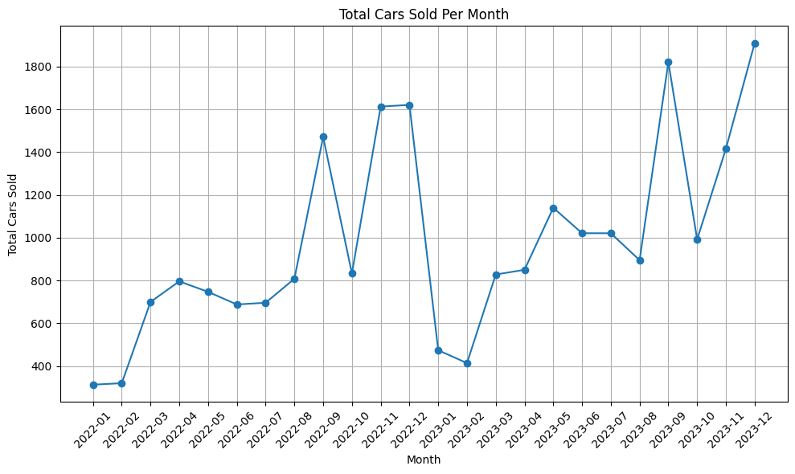
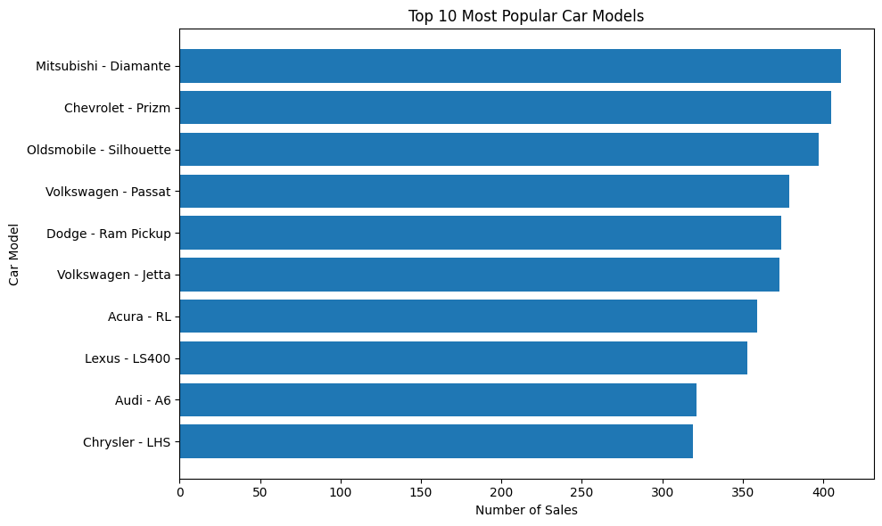
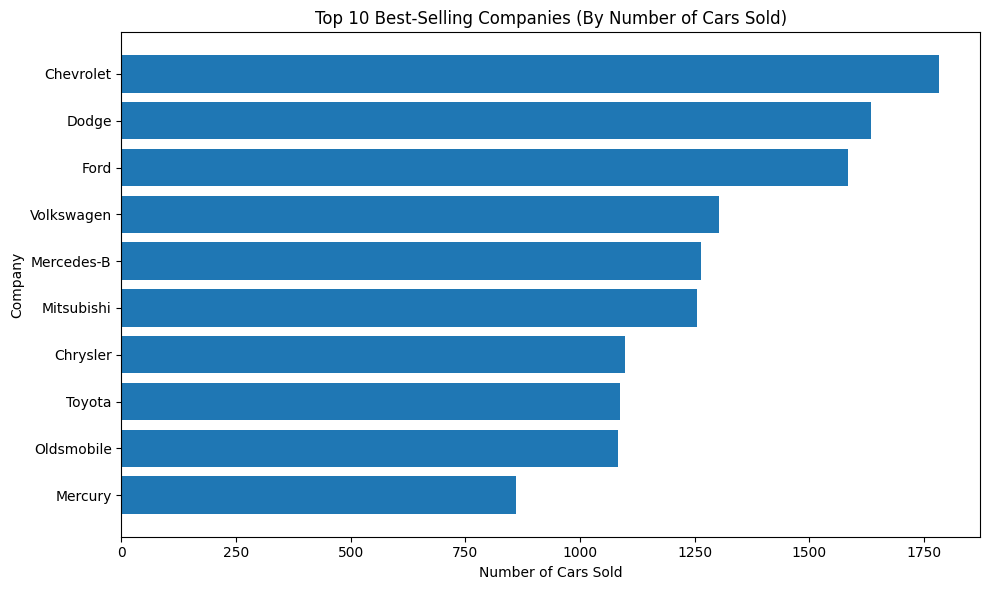
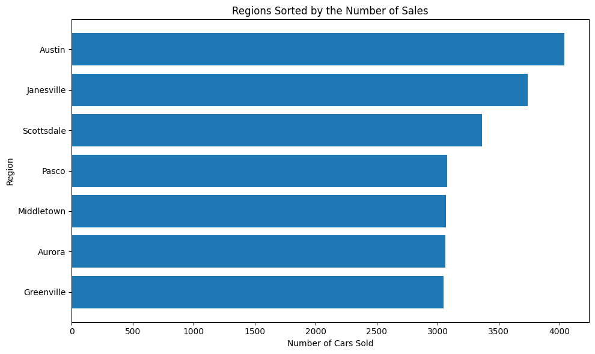
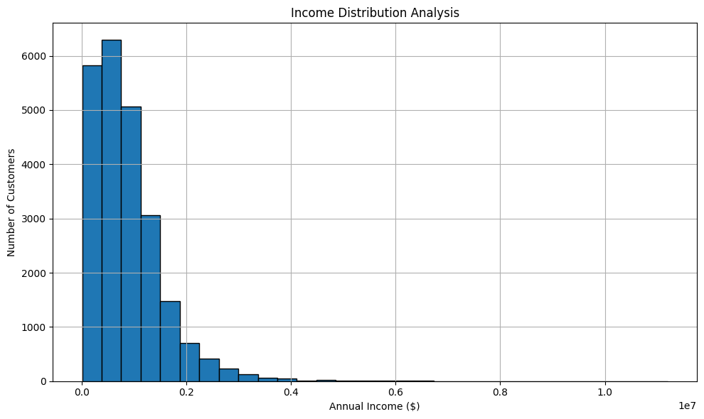
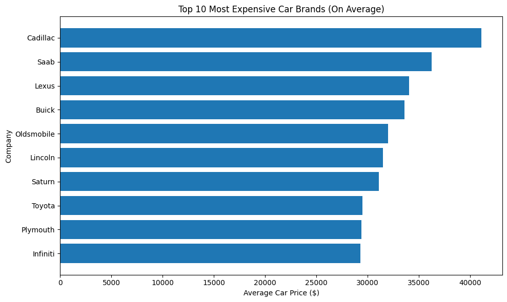
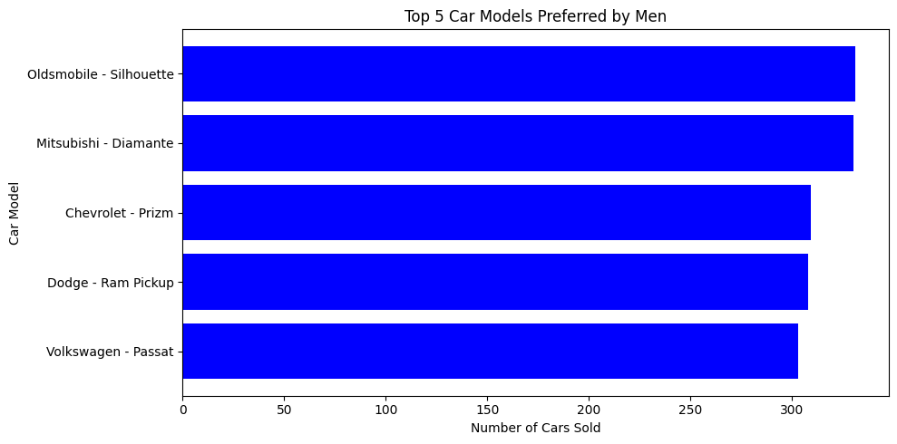
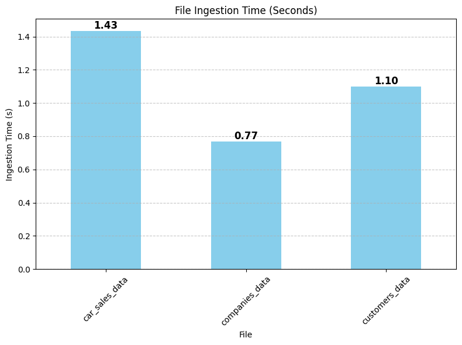
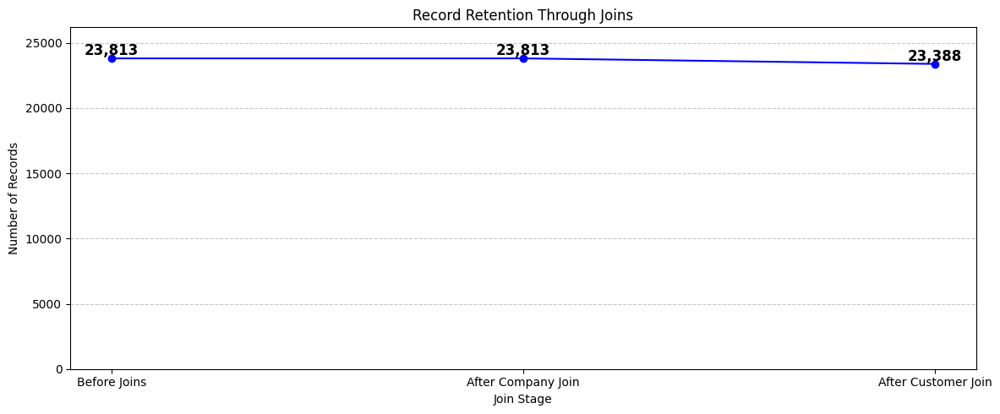

# Items in the example directory
- *profile* subdirectory
- *visualization* subdirectory
- *images* subdirectory

## profile subdirectory
The profile directory is generated through the [Profiling & Visualization](../code/02%20-%20Profiling%20&%20Visualizations.ipynb) notebook located in the code directory.
The profile directory contains the profile reports generated by the pandas profiling library.
The report is generated in the HTML format and it represents data from gold layer of medallion architecture.
It can be opened in the browser.

## visualization subdirectory
The visualization directory containts the *Report.pbix* file, which is the *Power BI* report for this project.
The report is generated through the Power BI Desktop application.
The report is used to visualize the data from the gold layer of the medallion architecture.
Power BI data source is set to web, and the url is set to the url we get from ngrok application plus /download_golden_data.

## images subdirectory
The images directory contains the .png files extracted from the data in the gold layer of the medallion architecture, pipeline statistics and time series modeling . They are given below:

### Images related to Gold Layer

### Images related to Pipeline Statistics

### Images related to TimeSeries Modeling

